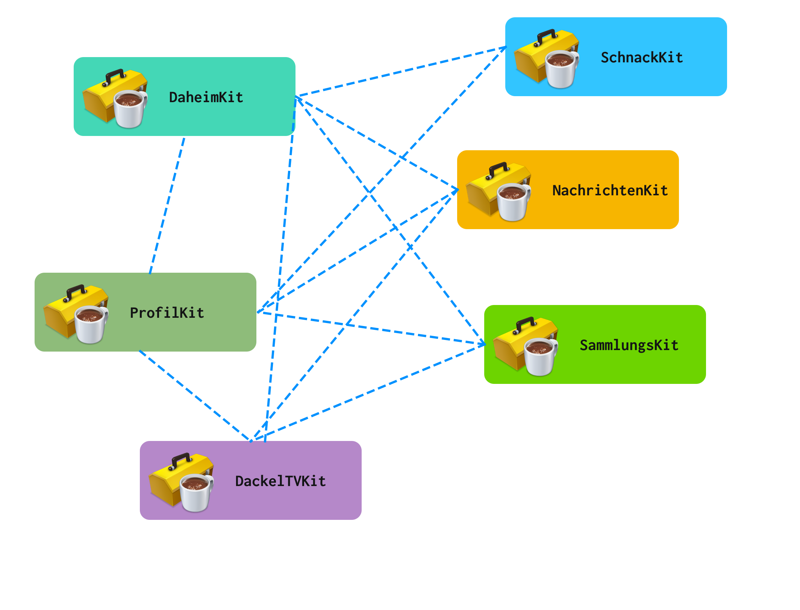
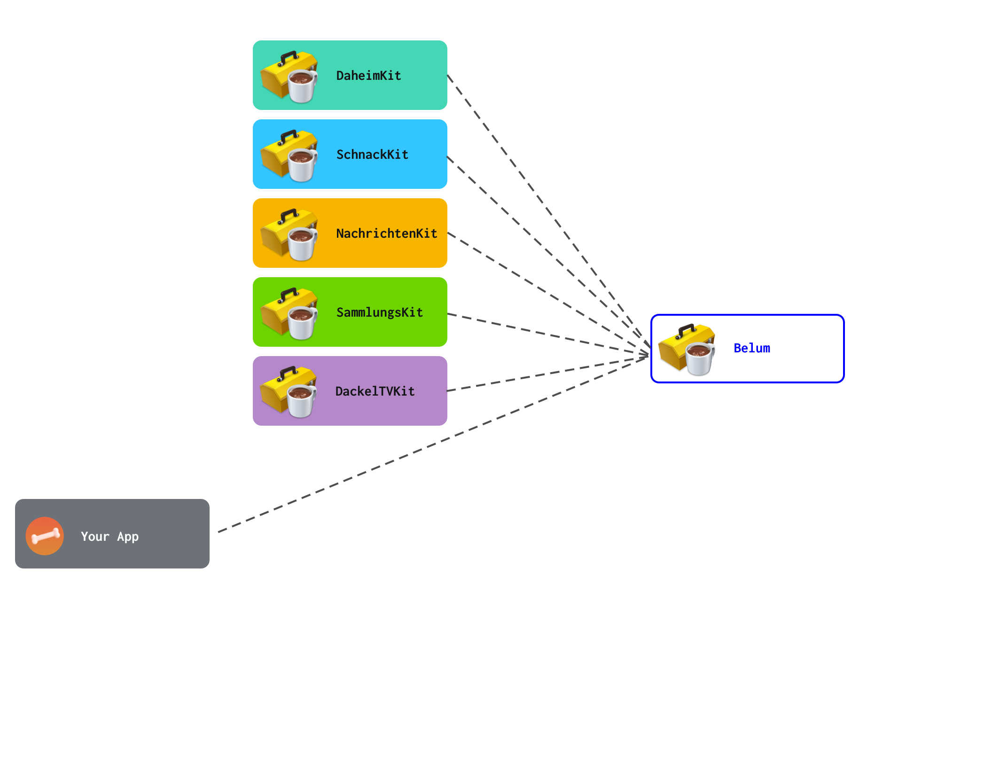

# Belum 🏺

## A lightweight, experimental, type-safe dependency injection container (cough) for Swift

Belum allows defining dependencies between frameworks / modules in Swift at runtime.

## What would I need this for?

Pictures say more than a thousand words. Imagine you have a social media app with the following frameworks (please excuse the German):

- DaheimKit: Home
- ProfilKit: Profile
- DackelTVKit: Social TV
- SchnackKit: Chat
- NachrichtenKit: News
- SammlungsKit: Your Collection

In a traditional project, your dependency tree would look like this



With a dependency injection container, your dependencies will be injected at runtime into the container.
Your invididual frameworks only know about the container - not about all the frameworks. Functionality is defined
via protocols. That way, your dependencies are much cleaner, none of your frameworks know about other frameworks.
Everything is hidden behind protocols. In addition, there're no cyclical dependencies because the frameworks don't
import each other.



## Why is this useful?

- Refactorings and new features become easier because you know the public interface (the protocol), so there's less danger of breaking internal behaviour
- Compile times are much faster. In fact, as long as the public protocol / interface remains stable, just compiling the current framework is sufficient. No need to compile the whole app
- Compile times are even faster because only the main app target imports all frameworks (compared to all frameworks import all others).
- All dependencies are defined in a central place (the app).
- You're not complicating your build system with a build-time solution
- You're not adding code generators such as Sourcery which add additional complexity. Everythin in here happens at runtime

## Aren't there already other solutions for Swift?

I'm glad you asked! Yes, there're, and they're much more production-ready than this solution. If I piqued your interest, head over to [Dip](https://github.com/AliSoftware/Dip) by my good friend [Olivier Halligon](https://github.com/AliSoftware).

## So why would I need this?

Compared to other solutions, the one used here is *very* minimal (which means easy to understand) and utilizes type-safety for a very
comfortable container usage experience.

## No, really

Really. However, it was also written as an example for a talk I gave at [MyPoster in Munich](https://myposter.de). Nevertheless, the ideas outlined in this repository are sound - though probably not production ready ;-)

## How does it work?

In comparison to other containers, the major idea in this solution is to have a pre-generated set of generic `struct` types mapping to the amount of possible dependencies. That way, keypaths can be used to access dependencies with their specific type. Code says more than a thousand words, so here we go.

We need one type that contains *all* the dependencies. However, only some of them are exposed to the other frameworks:

``` swift
public struct Dependencies {
    var chat: ChatProtocol!
    var home: HomeProtocol!
    var settings: SettingsProtocol!

    public init() {}
}

```

A framework / module defines its dependencies via a type-alias:

``` swift
typealias ChatDependencies = Dependencies2<
    Dependencies,
    HomeProtocol,
    SettingsProtocol
>
```

Here's we tell Swift that the `ChatDependencies` are based on the `Dependencies` struct, and take the `HomeProtocol` and the `SettingsProtocol`. Nothing more. So that Swift knows that our `Chat` module is only allowed to access the Home and Settings. Nothing else

Next up, we need the obligatory `protocol` and an initializer for our Chat:

``` swift
protocol ChatProtocol {
    var openChats: Int { get }
}

final class ChatController: ChatProtocol {
    // Conformance to the ChatProtocol
    var number: Int {
        42
    }

    // Required initializer with our dependencies
    public let dependencies: ChatDependencies
    public init(_ dependencies: ChatDependencies) {
        self.dependencies = dependencies
    }
}
```

If you imagine that have the same setup for our Settings and Home (see below), then we can initialize the
dependencies at runtime via calling the setup in our App / Main target:

``` swift
// Create a belum for the given dependencies
let belum = Belum(Dependencies())

// Add reverse dependencies
belum.setup { registrar in
    // Register the lazy closure for the creation of the ChatController
    // `$0` is the runtime-constructed dependency container (e.g. `ChatController.Dependencies2`)
    registrar.register(
        { ChatController($0) },
        // Which keypath in `Dependencies` to store this in
        for: \.chat,
        // The keypaths for the dependencies we're allowed to access
        dependencies: \.home, \.settings)
}
```

Here's a full example:

### An Example

Imagine an app with three dependencies, `chat`, `home`, `settings`

``` swift
public struct Dependencies {
    var chat: ChatProtocol!
    var home: HomeProtocol!
    var settings: SettingsProtocol!

    public init() {}
}


protocol SettingsProtocol {}

typealias settingsDependencies = Dependencies1<
    Dependencies,
    HomeProtocol
>

final class SettingsController: SettingsProtocol {
    public let dependencies: SettingsDependencies
    public init(_ dependencies: SettingsDependencies) {
        self.dependencies = dependencies
    }
}


protocol ChatProtocol {
    var openChats: Int { get }
}

typealias ChatDependencies = Dependencies2<
    Dependencies,
    HomeProtocol,
    SettingsProtocol
>

final class ChatController: ChatProtocol {
    var number: Int {
        42
    }

    public let dependencies: ChatDependencies
    public init(_ dependencies: ChatDependencies) {
        self.dependencies = dependencies
    }
}

protocol HomeProtocol {}

typealias HomeDependencies = Dependencies1<
    Dependencies,
    ChatProtocol
>

final class HomeController: HomeProtocol {
    public let dependencies: HomeDependencies
    public init(_ dependencies: HomeDependencies) {
        self.dependencies = dependencies
    }

    func openChats() -> String {
      guard let chats = dependencies.chat?.openChats() else { return "" }
      "\(chats)"
    }
}

let belum = Belum(Dependencies())
// Add reverse dependencies
belum.setup { registrar in
    registrar.register(
        { ChatController($0) },
        for: \.chat,
        dependencies: \.home, \.settings)
    registrar.register(
        { SettingsController($0) },
        for: \.settings,
        dependencies: \.home)
    registrar.register(
        { HomeController($0) },
        for: \.home,
        dependencies: \.chat)
}

```

## Generated Code

In addition to the `Dependencies2` struct in:

``` swift
typealias ChatDependencies = Dependencies2<
    Dependencies,
    HomeProtocol,
    SettingsProtocol
>
```

There're also `Dependencies3`, `Dependencies4`, etc. These are auto-generated via the `generate.swift` script in the root.

## Why is it considered lightweight?

Because apart from the huge chunk of generated code in the [Dependencies.swift](Source/Belum/Dependencies.swift), the main functionality
in [Belum.swift](Source/Belum/Belum.swift) is only ~70 lines of code. The generated code, on the other hand, is generated from a template of around ~20 lines of code. So the whole container (if we ignore repeated code generation) is defined in ~100 lines of code.

## Why is it not production ready?

Mainly because of threading reasons. Currently, in [Belum.swift](Source/Belum/Belum.swift), we're lazily constructing the dependencies, so that they're only constructed when they're first needed. However, we don't know from which threads the developer constructs which dependencies. Dictionary access in Swift is not concurrency-safe, so we need a mutex or a queue to make sure only one dependency is constructed at a time.
Currently, this code uses a Dispatch queue, but that is problematic as some dependencies will want to be created on the main queue. We can't create them on the main queue though, because we need a blocking / sync queue (because we require a return result), and blocking `main` when coming from `main` will result in a race condition. The sanest solution would be to not construct these dependencies lazily, but that is also so much less fun.

In reality, this project is mostly aimed as an experiment to showcase the idea. I'd rather not be the owner of a dependency injection library that is used in production level apps. I don't have the time for that. So, proceed with caution.

## Thanks for reading

License, MIT
